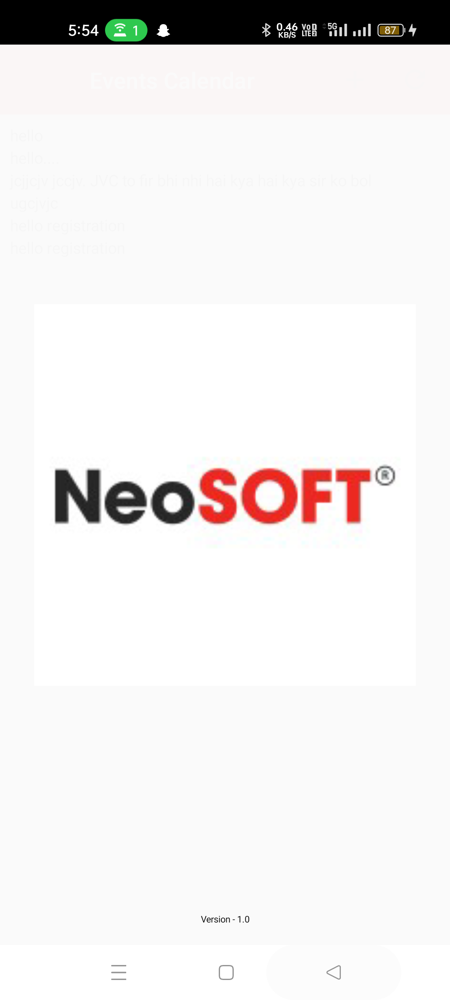
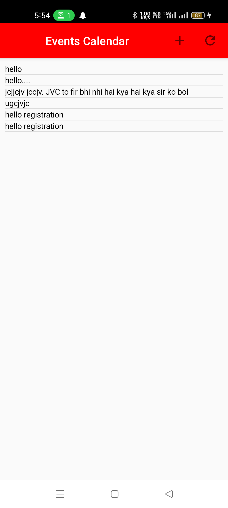
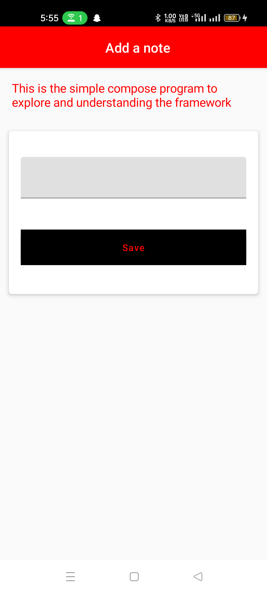

# Project: Learning & Development- Compose clean arch


## Features

- Splash Screen
- Add ToDo Screen
- ToDo Listing Screen


## Roadmap
- Learning Compose

- Need more work on abstraction

- Need to implement network calling

- Need to write testcase


## Tech Stack

**Client:** Compose, Kotlin


## Run Locally

Clone the project

```bash
  git clone https://github.com/droider91/clean-arch-compose.git
```

Open in Android studio


## Screenshots

​    


